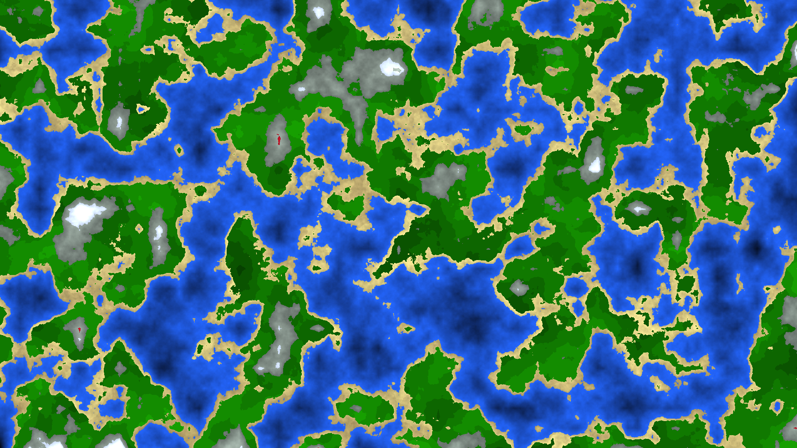

# Thomas' Little Shaders
Hi! My name is Thomas.

In 2017, me and my family went on a vacation trip to the island of Koh Samui, Thailand. There were many beautiful sights to see, and things to learn, and places to discover!

One night we went out to this restaurant my parents wanted to check out. I wasn't sure what to get, so I just went with the schnitzel, thinking "I probably can't go wrong with that one", but HOLY CRAP I have NEVER gotten food poisoning THAT BAD, seriously folks, if you ever go to Thailand DO NOT GET THE SCHNITZEL, THIS IS YOUR ONLY WARNING.

Now, you may be thinking, "Yo Thomas, what the fuck? Why are you writing this here?? Ain't this a goddamn shader library?" and yes, you'd be right. But It's important to remember that if it weren't for the events that occurred during that fateful 5th of February, none of these shaders would exist.

I could barely move for the following days. I started looking for things to do on my phone while stuck in bed, and as I was developing an interest for computer graphics I stumbled upon this amazing [Shader Editor App](https://play.google.com/store/apps/details?id=de.markusfisch.android.shadereditor) by [Markus Fisch](https://markusfisch.de/). At first they were, as my mom called them, "nice colors on your phone", but as my understanding of them got better they improved into more complex patterns and shapes.

Had it not been because of those arduous days, I would not have gotten into shaders that early. Had it not been because of that schnitzel, I wouldn't have started making videogame graphics effects for highschool projects, I wouldn't have gotten into OpenGL, I wouldn't have developed [TrippyGL](https://github.com/SilkCommunity/TrippyGL), my own graphics library, nor [Rectpack](https://github.com/ThomasMiz/RectpackSharp) alongside it, I wouldn't have helped around in [Silk.NET](https://github.com/dotnet/Silk.NET).

And in a certain way, I may owe it all to my brother and sister; who didn't hesitate to get medical help after I told him to or she found me half-unconscious on the floor respectively (Seriously, they did not hesitate. They both went back right to sleep).

With that crazy backstory now out of the way, let's get straight to it. Over the years, I have written many cool-looking shaders. The idea of this repo is to publish them so anyone can take a look, run them, or learn from them. Have fun!

## Running
These shaders are all written in GLSL and can be run using [The Book of Shaders' Editor](https://thebookofshaders.com/edit.php).

Open the in-web editor, copy the code of the file you want to run, and paste it into the editor. That's it!

## Gallery
### [Voronoi Black and White](artistic/voronoiBlackWhite.glsl)

### [FBM Mountains](complexNoise/fbmMountains.glsl)

### [Complex Terrain: "The Archipelago"](procTerrain/complexProcTerrain.glsl)

### [Procedural Bricks](misc/procBricks.glsl)
